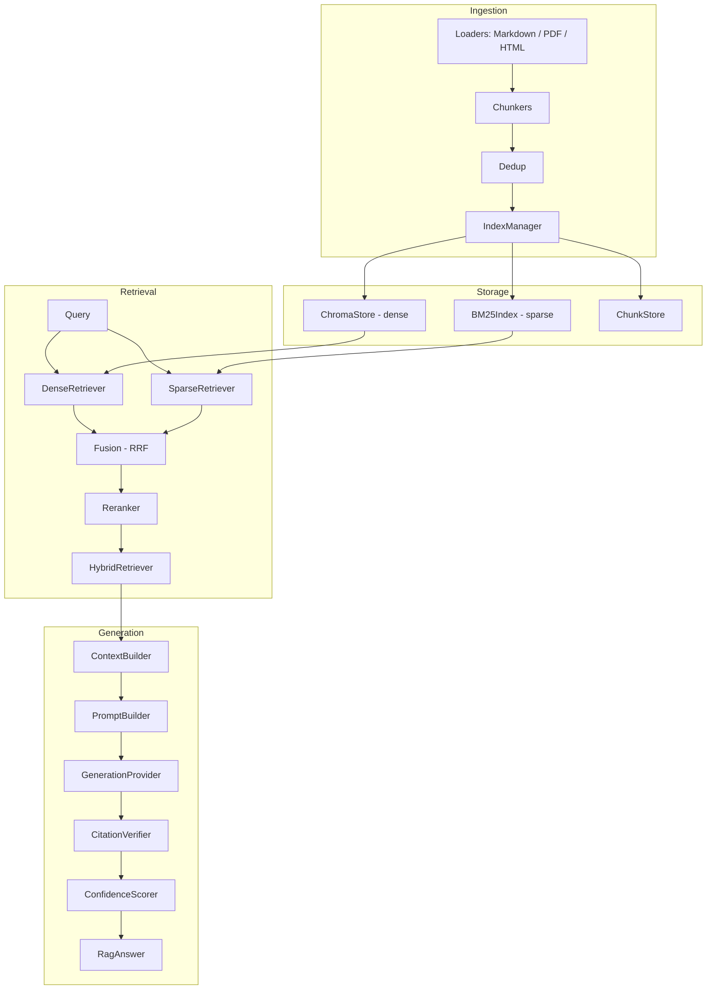

# rag-hybrid-search

A grounded, citation-verified RAG pipeline: hybrid (dense + sparse) retrieval with reranking, feeding a generation stage that verifies every claim against retrieved source text and scores its own confidence.

## Architecture



Two packages:

- `rag_hybrid_search/` — ingestion (loaders, chunkers, dedup), storage (Chroma dense store, BM25 sparse index, chunk store), retrieval (dense, sparse, RRF fusion, reranking, `HybridRetriever` orchestrator), and provider clients (NVIDIA, Ollama).
- `rag_pipeline/` — grounded generation on top of retrieval: `ContextBuilder`, `PromptBuilder`, `GenerationProvider` protocol + `MockProvider`, `CitationVerifier`, `ConfidenceScorer`, and the `RagPipeline` orchestrator.

## Key design points

- **Citation verification is not trust-based.** Every claim the model emits must cite chunk IDs, and `CitationVerifier` checks the claim's quote is actually substring-present (containment score against the retrieved chunk text) before it counts as verified. Unverifiable claims are flagged, not silently kept.
- **Confidence is deterministic, not another LLM call.** `ConfidenceScorer` combines retrieval quality, citation verification rate, and context coverage into `overall`/`retrieval`/`citations`/`coverage` scores — auditable and reproducible.
- **Generation failures degrade gracefully.** If the provider errors or returns unparseable output, `RagPipeline.answer()` returns a `RagAnswer` with `error` set and zeroed confidence instead of raising.

## Usage

```python
from rag_hybrid_search.retrieval.retriever import HybridRetriever
from rag_pipeline.rag_pipeline import RagPipeline
from rag_pipeline.generation_provider import MockProvider

retriever = HybridRetriever(...)  # wired to your ChromaStore/BM25Index
pipeline = RagPipeline(retriever=retriever, generation_provider=MockProvider())

result = pipeline.answer("How many days of paid leave do employees get?")

print(result.answer)
print(result.citations)          # chunk IDs backing the answer
print(result.confidence.overall) # 0.0-1.0
print(result.verification)       # per-claim verification report
```

### Real LLM provider

Swap `MockProvider` for `GeminiProvider` to generate against a real model (free-tier API, no local install required):

```bash
export GEMINI_API_KEY=your_api_key
```

```python
from rag_hybrid_search.providers.gemini import GeminiProvider

pipeline = RagPipeline(retriever=retriever, generation_provider=GeminiProvider(api_key="..."))
```

`NvidiaProvider` (`rag_hybrid_search/providers/nvidia.py`) is also available behind the same `GenerationProvider` interface if you have an NVIDIA API key.

## API

A thin FastAPI service (`api/`) exposes the same pipeline over HTTP, in addition to the library usage above — the library remains directly importable exactly as documented in [Usage](#usage).

Provider selection is automatic based on which API keys are set in the environment (`RAG_GEMINI_API_KEY`, `RAG_NVIDIA_API_KEY`): with no keys set, it falls back to `MockProvider` for generation and a deterministic `FakeEmbeddingProvider` for embeddings — useful for trying the API without any credentials, but `/answer` won't produce a grounded, real answer in that mode. `GET /health` reports which providers were actually selected.

### Run locally

```bash
uv sync
uv run uvicorn api.main:app --reload
```

Swagger/OpenAPI docs are auto-available at `http://localhost:8000/docs` (FastAPI default).

### Run via Docker

```bash
docker build -t rag-hybrid-search .
docker run --rm -p 8000:8000 rag-hybrid-search
```

### Endpoints

**`POST /index`** — ingest one or more documents (`.md`, `.markdown`, `.html`, `.htm`, `.txt`):

```bash
curl -X POST http://localhost:8000/index \
  -H "Content-Type: application/json" \
  -d '{"documents": [{"filename": "leave-policy.md", "content": "Employees get 20 days of paid annual leave per year."}]}'
```

```json
{"results": [{"filename": "leave-policy.md", "status": "ready", "error": null}]}
```

**`POST /answer`** — ask a grounded question against the indexed corpus:

```bash
curl -X POST http://localhost:8000/answer \
  -H "Content-Type: application/json" \
  -d '{"question": "How many days of paid leave do employees get?", "max_chunks": 5, "verify": true}'
```

```json
{"answer": "...", "citations": ["d1"], "confidence": {"overall": 0.8, "...": "..."}, "verification": {"...": "..."}, "error": null}
```

**`GET /health`** — reports the providers actually selected and where data is persisted:

```bash
curl http://localhost:8000/health
```

```json
{"status": "ok", "generation_provider": "mock", "embedding_provider": "fake", "data_dir": "./data"}
```

**`GET /version`** — package name and version:

```bash
curl http://localhost:8000/version
```

```json
{"name": "rag-hybrid-search", "version": "0.1.0"}
```

## Benchmark

Retrieval-quality regression check over a small fixed corpus: **Recall@3 = 1.00, MRR = 1.00** across 6 queries. See [docs/BENCHMARK.md](docs/BENCHMARK.md) for methodology, honest scope (small toy corpus, deterministic fake embeddings), and how to reproduce it (`uv run python -m scripts.benchmark`).

## Running tests

```bash
uv sync
uv run pytest -q
```

**130/130 tests passing** (122 pre-existing + 8 API tests), full suite runtime ~2.5min on a local M-series MacBook.

## Docker

```bash
docker build -t rag-hybrid-search .
docker run --rm -p 8000:8000 rag-hybrid-search
```

The image installs dependencies via `uv` and launches the FastAPI service via `uvicorn` on port 8000 as its default command (see [API](#api) above).

## Project layout

```
rag_hybrid_search/
  ingestion/      loaders, chunkers, dedup
  storage/        chroma_store, bm25_index, chunk_store, index_manager
  retrieval/      dense, sparse, fusion (RRF), rerank, retriever
  providers/      nvidia, ollama client wrappers
rag_pipeline/
  models.py               pydantic contracts (Claim, RagAnswer, ...)
  context_builder.py
  prompt_builder.py
  generation_provider.py  protocol + MockProvider
  citation_verifier.py
  confidence_scorer.py
  rag_pipeline.py         orchestrator
api/
  main.py           FastAPI app instance + startup wiring
  routes.py         /answer, /index, /health, /version handlers
  schemas.py        request/response pydantic models
  dependencies.py   singleton construction + provider fallback selection
docs/superpowers/
  specs/, plans/          design docs this codebase was built from
```

## Status

v1.1.0 — core hybrid retrieval + grounded generation pipeline, plus a thin FastAPI HTTP layer (`api/`) backed by a persistent on-disk index under `data_dir`. 130 tests green. Usable both as a library (unchanged) and as a service.

## License

MIT — see [LICENSE](LICENSE).
