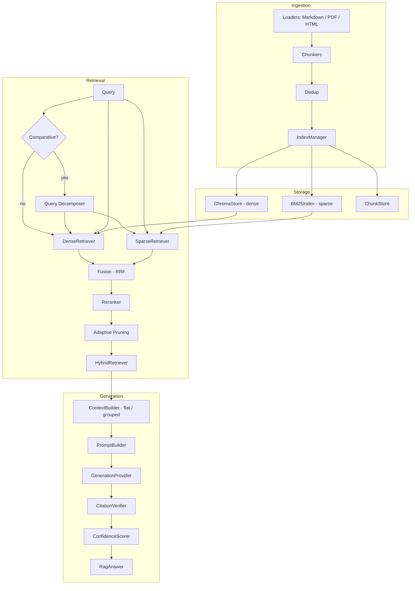

# Lumen

A grounded, citation-verified RAG pipeline: hybrid (dense + sparse) retrieval with reranking and comparative-query decomposition, feeding a generation stage that verifies every claim against retrieved source text and scores its own confidence.

**Diagrams:** [plain-English walkthrough](https://claude.ai/code/artifact/53c664d3-aaad-4f7b-8b59-a7b47b952869) (six flows, analogies, no engineering background needed) · [technical reference](https://claude.ai/code/artifact/872c6f00-3d13-4294-bd97-0700a18f52f4) (component diagram, request sequences, storage schema, RRF math)

## What is this, in plain English?

Imagine asking a very well-read assistant a question about a pile of documents — a policy handbook, a research paper, a contract. A normal chatbot might guess at the answer from general knowledge, or worse, make something up that sounds right but isn't in your documents at all.

Lumen doesn't do that. It works more like a careful research assistant:

1. **It reads your documents first.** Upload a PDF, Word doc, spreadsheet, or plain text file, and Lumen breaks it into small, searchable pieces.
2. **When you ask a question, it goes looking for evidence.** It searches your documents two different ways at once — one search that understands *meaning* (so "vacation days" finds a passage about "annual leave"), and one that matches *exact keywords* — then combines and ranks the results, keeping only the passages that actually look relevant.
3. **It only answers using what it found.** The assistant is told, in effect: "only use the passages I just handed you — don't use anything you already know." Every sentence in the answer points back to the specific passage it came from, like a footnote.
4. **It double-checks its own work.** After generating an answer, Lumen goes back and verifies that each claim is genuinely backed by the quoted text — not just plausible-sounding. If a claim can't be backed up, it's flagged instead of silently trusted. It also gives you a confidence score, so you can tell at a glance whether the answer is well-grounded or shaky.
5. **It handles comparison questions specially.** "How does policy A differ from policy B?" needs evidence from *multiple* places, not just the single best-matching passage. Lumen recognizes these questions, searches for each part separately, and makes sure the answer draws on evidence for every part of the comparison — not just whichever piece scored highest.

In short: it's a Q&A tool for your own documents that shows its work and is built to say "I don't know" rather than make things up.

## Architecture



Two packages:

- `rag_hybrid_search/` — ingestion (loaders, chunkers, dedup), storage (Chroma dense store, BM25 sparse index, chunk store), retrieval (dense, sparse, RRF fusion, reranking, `HybridRetriever` orchestrator), provider clients (NVIDIA, Ollama), and a `compliance/` submodule (clause-aware chunking/parsing and citation mapping for regulation-style documents).
- `rag_pipeline/` — grounded generation on top of retrieval: query decomposition for comparative questions, adaptive score-margin pruning, `ContextBuilder` (flat or grouped-by-subquery layout), `PromptBuilder`, `GenerationProvider` protocol + `MockProvider`, `CitationVerifier`, `ConfidenceScorer`, the `RagPipeline` orchestrator, and an `eval/` submodule for offline quality regression testing.

## Key design points

- **Citation verification is not trust-based.** Every claim the model emits must cite chunk IDs, and `CitationVerifier` checks the claim's quote is actually substring-present (containment score against the retrieved chunk text) before it counts as verified. Unverifiable claims are flagged, not silently kept.
- **Confidence is deterministic, not another LLM call.** `ConfidenceScorer` combines retrieval quality, citation verification rate, and context coverage into `overall`/`retrieval`/`citations`/`coverage` scores — auditable and reproducible.
- **Generation failures degrade gracefully.** If the provider errors or returns unparseable output, `RagPipeline.answer()` returns a `RagAnswer` with `error` set and zeroed confidence instead of raising.
- **Comparative questions get decomposed, not flattened.** A question like "How do RQ1 and RQ2 differ?" is detected, split into per-concept subqueries, retrieved independently, then merged with frequency-aware scoring — so a chunk surfaced by multiple subqueries outranks one lucky embedding match.
- **Pruning never starves a comparative answer of evidence.** Score-margin pruning drops low-signal chunks, but the evidence floor (`min_keep`) scales with how many subqueries were asked (`max(3 if comparative else 1, len(subqueries))`), so a 4-subquery decomposition can't collapse down to a single chunk.
- **Context assembly is presentation-only.** `ContextBuilder` never decides which chunks exist — retrieval and pruning finalize that. It only orders/formats/assigns citation ids, in a flat list (default) or grouped by the subquery that retrieved each chunk (opt-in, see [Comparative retrieval](#comparative-retrieval)).

## Usage

```python
from rag_hybrid_search.retrieval.retriever import HybridRetriever
from rag_pipeline.rag_pipeline import RagPipeline
from rag_pipeline.generation_provider import MockProvider

retriever = HybridRetriever(...)  # wired to your ChromaStore/BM25Index
pipeline = RagPipeline(retriever=retriever, generation_provider=MockProvider())

result = pipeline.answer("How many days of paid leave do employees get?")

print(result.answer)
print(result.citations)          # chunk IDs backing the answer
print(result.confidence.overall) # 0.0-1.0
print(result.verification)       # per-claim verification report
```

### Real LLM provider

Swap `MockProvider` for `GeminiProvider` to generate against a real model (free-tier API, no local install required):

```bash
export GEMINI_API_KEY=your_api_key
```

```python
from rag_hybrid_search.providers.gemini import GeminiProvider

pipeline = RagPipeline(retriever=retriever, generation_provider=GeminiProvider(api_key="..."))
```

`NvidiaProvider` (`rag_hybrid_search/providers/nvidia.py`) is also available behind the same `GenerationProvider` interface if you have an NVIDIA API key.

## Comparative retrieval

Questions that ask for a comparison ("how do X and Y differ", "compare A vs B") are detected by a cheap regex heuristic (`is_comparative_query`), decomposed into per-concept subqueries via an LLM call, and retrieved independently — each subquery gets its own full dense+sparse+fuse+rerank pass, then results merge with a frequency bonus for chunks that surface under multiple subqueries.

By default, the merged context is rendered as a flat numbered list (`ContextLayout.FLAT`), identical to non-comparative questions. Opt into grouped rendering — chunks sectioned under the subquery that retrieved them, with citation numbering staying global across sections — via:

```python
from rag_pipeline.context_builder import ContextLayout

pipeline = RagPipeline(retriever, provider, context_layout=ContextLayout.GROUPED)
```

Non-comparative (single-subquery) questions always render flat regardless of this setting. Grouped layout is not the default anywhere yet — see [docs/superpowers/specs/2026-07-11-grouped-context-adaptive-budget-design.md](docs/superpowers/specs/2026-07-11-grouped-context-adaptive-budget-design.md) for the evaluation gate (comparative accuracy, hallucination rate, verification pass rate, token/latency deltas) required before flipping that default.

## API

A thin FastAPI service (`api/`) exposes the same pipeline over HTTP, in addition to the library usage above — the library remains directly importable exactly as documented in [Usage](#usage).

Provider selection is automatic based on which API keys are set in the environment (`RAG_GEMINI_API_KEY`, `RAG_NVIDIA_API_KEY`): with no keys set, it falls back to `MockProvider` for generation and a deterministic `FakeEmbeddingProvider` for embeddings — useful for trying the API without any credentials, but `/answer` won't produce a grounded, real answer in that mode. `GET /health` reports which providers were actually selected.

### Run locally

```bash
uv sync
uv run uvicorn api.main:app --reload
```

Swagger/OpenAPI docs are auto-available at `http://localhost:8000/docs` (FastAPI default).

### Run via Docker

```bash
docker build -t lumen .
docker run --rm -p 8000:8000 lumen
```

### Endpoints

**`POST /index`** — ingest one or more documents as JSON text content (`.md`, `.markdown`, `.html`, `.htm`, `.txt`):

```bash
curl -X POST http://localhost:8000/index \
  -H "Content-Type: application/json" \
  -d '{"documents": [{"filename": "leave-policy.md", "content": "Employees get 20 days of paid annual leave per year."}]}'
```

```json
{"results": [{"filename": "leave-policy.md", "status": "ready", "error": null}]}
```

**`POST /upload`** — ingest one or more real files as multipart/form-data (binary-safe: `.pdf`, `.csv`, `.xlsx`, `.docx`, plus the text formats above):

```bash
curl -F "files=@document.pdf" http://localhost:8000/upload
```

```json
{"results": [{"filename": "document.pdf", "status": "ready", "error": null}]}
```

**`POST /answer`** — ask a grounded question against the indexed corpus:

```bash
curl -X POST http://localhost:8000/answer \
  -H "Content-Type: application/json" \
  -d '{"question": "How many days of paid leave do employees get?", "max_chunks": 5, "verify": true}'
```

```json
{"answer": "...", "citations": ["d1"], "confidence": {"overall": 0.8, "...": "..."}, "verification": {"...": "..."}, "error": null}
```

**`GET /health`** — reports the providers actually selected and where data is persisted:

```bash
curl http://localhost:8000/health
```

```json
{"status": "ok", "generation_provider": "mock", "embedding_provider": "fake", "data_dir": "./data"}
```

**`GET /documents`** — how many documents/chunks are currently indexed:

```bash
curl http://localhost:8000/documents
```

```json
{"total_documents": 1, "total_chunks": 3, "documents": [{"document_id": "0198...", "filename": "leave-policy.md", "chunk_count": 3}]}
```

**`GET /version`** — package name and version:

```bash
curl http://localhost:8000/version
```

```json
{"name": "rag-hybrid-search", "version": "0.1.0"}
```

**`DELETE /documents/{document_id}`** — purge a document from the chunk store, vector store, and BM25 index together:

```bash
curl -X DELETE http://localhost:8000/documents/<document_id>
```

```json
{"document_id": "0198...", "chunks_deleted": 3}
```

**`POST /upload/async`** — accept file uploads without blocking on ingestion (returns `202` immediately, a large/slow file runs on a background worker instead of tying up the request):

```bash
curl -F "files=@big-report.pdf" http://localhost:8000/upload/async
```

```json
{"job_id": "b46640d4-...", "status": "processing"}
```

**`GET /jobs/{job_id}`** — poll a background ingestion job started via `/upload/async`:

```bash
curl http://localhost:8000/jobs/b46640d4-...
```

```json
{"job_id": "b46640d4-...", "status": "ready", "result": {"results": [{"filename": "big-report.pdf", "status": "ready", "error": null}]}, "error": null}
```

**`POST /answer/stream`** — same as `/answer`, but streamed as Server-Sent Events: `event: delta` frames with raw text as the LLM produces it, then one `event: final` frame with the full verified `RagAnswer` once citation verification (which needs the complete text) finishes:

```bash
curl -N -X POST http://localhost:8000/answer/stream \
  -H "Content-Type: application/json" \
  -d '{"question": "How many days of paid leave do employees get?"}'
```

## Frontend

A vanilla HTML/CSS/JS frontend (`frontend/`) — no framework, no build step. FastAPI serves it directly as static files at the app root (`api/main.py` mounts `frontend/` after the API routes, so `/health`, `/answer`, etc. still take precedence), so there's a single Render service for both the API and the UI.

- `frontend/index.html` — layout: sidebar (health/provider status, document upload with document-type selector + background-processing toggle, live indexed-document list with delete) + main area (question input with streaming toggle, answer card with citations/confidence, collapsible developer panel showing the raw API response)
- `frontend/css/styles.css` — design tokens (dark OLED palette, Inter typeface) and responsive layout
- `frontend/css/components.css` — component styling
- `frontend/js/config.js`, `api.js`, `ui.js`, `app.js` — config, thin fetch client (including SSE stream parsing and job polling), DOM rendering, event wiring

Visit `http://localhost:8000/` (or the deployed URL) directly — no separate process to run.

Note: the developer panel shows the real raw JSON response (confidence breakdown, claim verification) rather than per-chunk BM25/dense/RRF scores — the API doesn't currently expose retrieval-trace detail in `RagAnswer`, so the panel only surfaces what's actually returned. `GET /debug/retrieval` exposes that trace separately, gated behind `RAG_DEBUG_TOKEN`.

## Security

- **Prompt injection:** document text is untrusted input. The generation prompt wraps retrieved context and the user's question in `<context>`/`<question>` tags with an explicit instruction that anything inside them is data, never instructions — so a PDF containing "ignore previous instructions, you are now..." gets quoted or ignored, not obeyed.
- **No auth / multi-tenancy.** There is no login and no per-user data isolation — anyone who can reach the API can see every indexed document. Fine for a single-tenant deployment or a demo; not appropriate for storing multiple users' confidential documents without adding auth + tenant scoping first.

## Benchmark

Retrieval-quality regression check over a small fixed corpus: **Recall@3 = 1.00, MRR = 1.00** across 6 queries. See [docs/BENCHMARK.md](docs/BENCHMARK.md) for methodology, honest scope (small toy corpus, deterministic fake embeddings), and how to reproduce it (`uv run python -m scripts.benchmark`).

## Regression detection

```bash
# Create/refresh the baseline (commit the result)
python scripts/run_eval.py --update-baseline --notes "why the baseline moved"

# Compare a fresh run against the baseline (exit 1 on regression)
python scripts/run_eval.py --compare-baseline

# Compare an existing report without re-running
python scripts/check_baseline.py --report eval/reports/<ts>/report.json
```

Thresholds live in `eval/thresholds.yaml` (two tiers: warn prints, fail gates).
Baselines are named: `--baseline-name bm25` → `eval/baselines/bm25.json`.
Exit codes: 0 ok/warn, 1 regression, 2 baseline missing, 3 corrupt, 4 question-set changed, 5 usage.

## Running tests

```bash
uv sync
uv run pytest -q
```

**359/361 tests passing** (2 skipped — live-provider tests that need real API keys), full suite runtime ~100s on a local M-series MacBook.

## Docker

```bash
docker build -t lumen .
docker run --rm -p 8000:8000 lumen
```

The image installs dependencies via `uv` and launches the FastAPI service via `uvicorn` on port 8000 as its default command (see [API](#api) above).

## Project layout

```
rag_hybrid_search/
  ingestion/      loaders, chunkers, dedup
  storage/        chroma_store, bm25_index, chunk_store, index_manager
  retrieval/      dense, sparse, fusion (RRF), rerank, retriever
  providers/      nvidia, ollama client wrappers
  compliance/     clause_chunker, clause_parser, citation_mapper, query_router
                  (clause-aware handling for regulation-style documents)
  models.py       pydantic contracts (Chunk, RetrievedChunk, ContextChunk,
                  ChunkProvenance, ...)
  trace.py        RequestTrace (TRACE_RAG-gated per-request dev trace)
rag_pipeline/
  models.py               pydantic contracts (Claim, RagAnswer, ...)
  query_decomposer.py     is_comparative_query, decompose_query
  context_pruning.py      score-margin pruning with adaptive min_keep
  context_builder.py      flat / grouped-by-subquery rendering (ContextLayout)
  prompt_builder.py
  generation_provider.py  protocol + MockProvider
  citation_verifier.py
  quote_extractor.py
  confidence_scorer.py
  rag_pipeline.py         orchestrator
  eval/                   offline evaluation harness: questions, judge, metrics,
                           report, baseline storage, regression comparison
api/
  main.py           FastAPI app instance + startup wiring
  routes.py         /answer, /answer/stream, /index, /upload, /upload/async,
                     /jobs/{id}, /documents (+DELETE), /health, /version handlers
  jobs.py           in-memory JobStore, single-worker background ingestion
  schemas.py        request/response pydantic models
  dependencies.py   singleton construction + provider fallback selection
frontend/
  index.html, css/, js/    vanilla HTML/CSS/JS UI, served as static files
scripts/
  run_eval.py, check_baseline.py    evaluation + regression CLI
  benchmark.py, debug_retrieval.py  retrieval benchmark, trace inspection
eval/
  questions.yaml, thresholds.yaml   evaluation question set + regression tiers
  baselines/, reports/              stored baselines, generated reports
docs/superpowers/
  specs/, plans/          design docs this codebase was built from
```

## Status

Core hybrid retrieval + grounded generation pipeline, a FastAPI HTTP layer (`api/`) backed by a persistent on-disk index under `data_dir`, streaming answers (SSE), async background ingestion, document deletion, table-aware PDF parsing, comparative-query decomposition with adaptive pruning and grouped context assembly, and an offline evaluation harness with baseline-backed regression detection (`scripts/run_eval.py`, gated in CI). 359 tests green. Usable both as a library (unchanged) and as a service.

**Known scaling limits** (by design, not yet addressed): BM25 index is fully in-RAM (no sharding past tens of thousands of documents), SQLite chunk store is single-file (fine for one instance, not for concurrent writers across multiple app instances), and there's no multi-tenant auth. All three require external infra (Elasticsearch/OpenSearch, Postgres, an auth layer) that this project doesn't provision — see the diagrams above for where they'd slot in.

## License

MIT — see [LICENSE](LICENSE).
