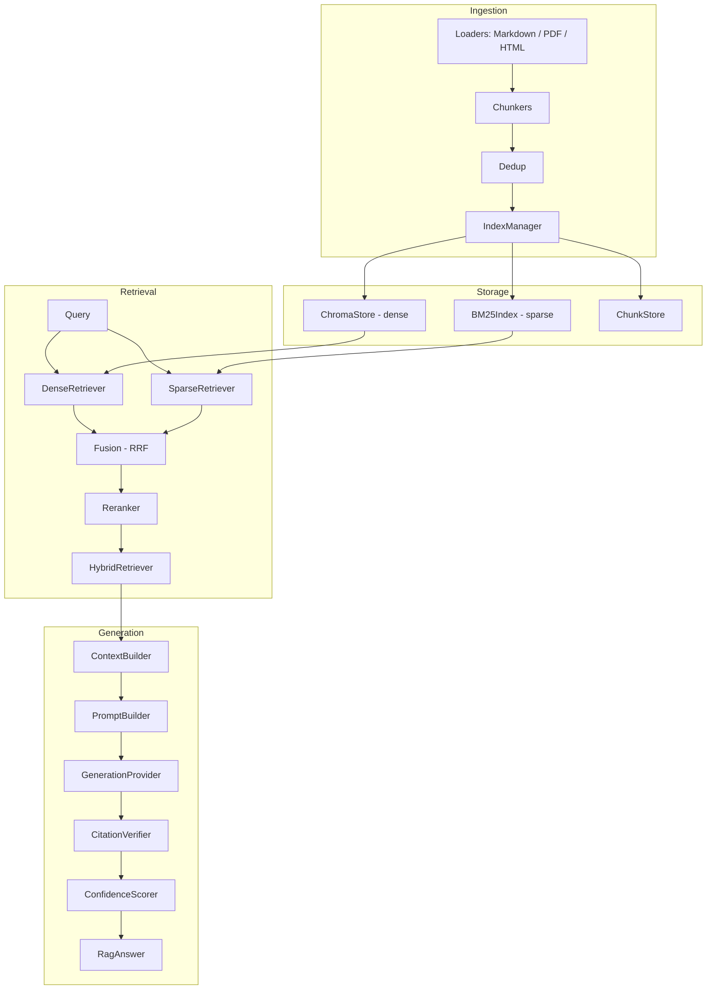

# rag-hybrid-search

A grounded, citation-verified RAG pipeline: hybrid (dense + sparse) retrieval with reranking, feeding a generation stage that verifies every claim against retrieved source text and scores its own confidence.

## Architecture



Two packages:

- `rag_hybrid_search/` — ingestion (loaders, chunkers, dedup), storage (Chroma dense store, BM25 sparse index, chunk store), retrieval (dense, sparse, RRF fusion, reranking, `HybridRetriever` orchestrator), and provider clients (NVIDIA, Ollama).
- `rag_pipeline/` — grounded generation on top of retrieval: `ContextBuilder`, `PromptBuilder`, `GenerationProvider` protocol + `MockProvider`, `CitationVerifier`, `ConfidenceScorer`, and the `RagPipeline` orchestrator.

## Key design points

- **Citation verification is not trust-based.** Every claim the model emits must cite chunk IDs, and `CitationVerifier` checks the claim's quote is actually substring-present (containment score against the retrieved chunk text) before it counts as verified. Unverifiable claims are flagged, not silently kept.
- **Confidence is deterministic, not another LLM call.** `ConfidenceScorer` combines retrieval quality, citation verification rate, and context coverage into `overall`/`retrieval`/`citations`/`coverage` scores — auditable and reproducible.
- **Generation failures degrade gracefully.** If the provider errors or returns unparseable output, `RagPipeline.answer()` returns a `RagAnswer` with `error` set and zeroed confidence instead of raising.

## Usage

```python
from rag_hybrid_search.retrieval.retriever import HybridRetriever
from rag_pipeline.rag_pipeline import RagPipeline
from rag_pipeline.generation_provider import MockProvider

retriever = HybridRetriever(...)  # wired to your ChromaStore/BM25Index
pipeline = RagPipeline(retriever=retriever, generation_provider=MockProvider())

result = pipeline.answer("How many days of paid leave do employees get?")

print(result.answer)
print(result.citations)          # chunk IDs backing the answer
print(result.confidence.overall) # 0.0-1.0
print(result.verification)       # per-claim verification report
```

### Real LLM provider

Swap `MockProvider` for `GeminiProvider` to generate against a real model (free-tier API, no local install required):

```bash
export GEMINI_API_KEY=your_api_key
```

```python
from rag_hybrid_search.providers.gemini import GeminiProvider

pipeline = RagPipeline(retriever=retriever, generation_provider=GeminiProvider(api_key="..."))
```

`NvidiaProvider` (`rag_hybrid_search/providers/nvidia.py`) is also available behind the same `GenerationProvider` interface if you have an NVIDIA API key.

## Benchmark

Retrieval-quality regression check over a small fixed corpus: **Recall@3 = 1.00, MRR = 1.00** across 6 queries. See [docs/BENCHMARK.md](docs/BENCHMARK.md) for methodology, honest scope (small toy corpus, deterministic fake embeddings), and how to reproduce it (`uv run python -m scripts.benchmark`).

## Running tests

```bash
uv sync
uv run pytest -q
```

**121/121 tests passing**, full suite runtime ~83s on a local M-series MacBook.

## Docker

```bash
docker build -t rag-hybrid-search .
docker run --rm rag-hybrid-search
```

The image installs dependencies via `uv` and runs the full test suite as its default command — swap the `CMD` for a script/entrypoint of your own to run the pipeline against real documents.

## Project layout

```
rag_hybrid_search/
  ingestion/      loaders, chunkers, dedup
  storage/        chroma_store, bm25_index, chunk_store, index_manager
  retrieval/      dense, sparse, fusion (RRF), rerank, retriever
  providers/      nvidia, ollama client wrappers
rag_pipeline/
  models.py               pydantic contracts (Claim, RagAnswer, ...)
  context_builder.py
  prompt_builder.py
  generation_provider.py  protocol + MockProvider
  citation_verifier.py
  confidence_scorer.py
  rag_pipeline.py         orchestrator
docs/superpowers/
  specs/, plans/          design docs this codebase was built from
```

## Status

v1.0.0 — core hybrid retrieval + grounded generation pipeline complete, 121 tests green. No FastAPI/HTTP layer or persistent-vs-ephemeral deployment story yet; the project is a library, not a service, at this tag.

## License

MIT — see [LICENSE](LICENSE).
